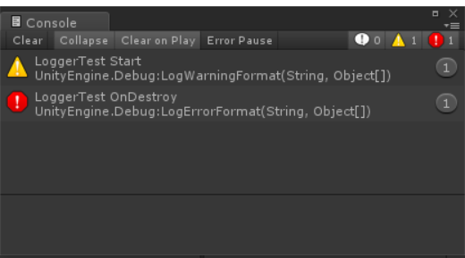

# MGS-Logger

## Summary
- Logger for Unity project.

## Environment
- Unity 5.0 or above.
- .Net Framework 3.5 or above.

## Achieve
- Output log to Unity console.
- Output log to local file.
- Implement custom logger to output the log that print by LogUtility from other module.

## Demo
- Demos in the path "MGS-Logger/Scenes" provide reference to you.

## Preview
- Log Output

## Contact
- If you have any questions, feel free to contact me at mogoson@outlook.com.